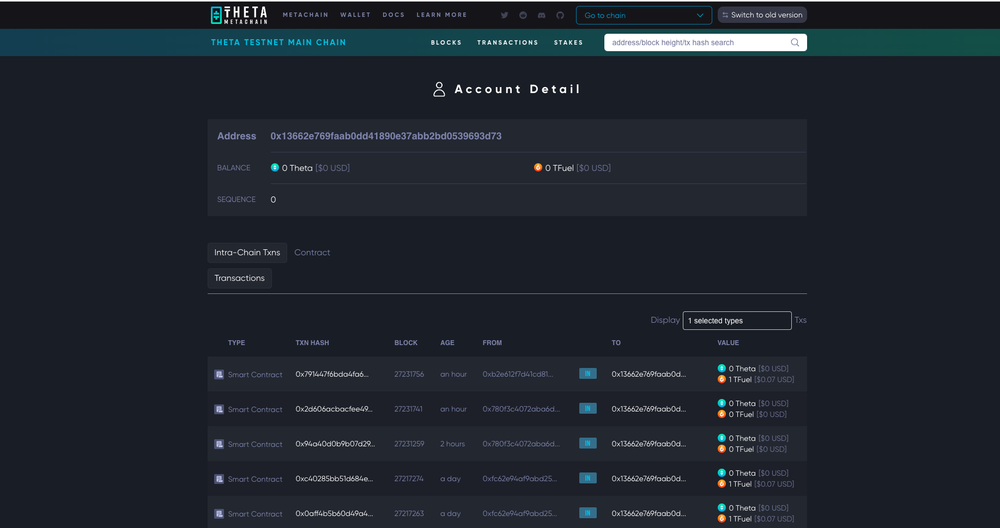

    

## CreatorMatch

A smart contract mediated marketplace connecting creators with sponsors/supporters, managed by Theta blockchain technology.

Going for the Real world applications and finance category of https://theta2024.devpost.com/

Live Demo URL (deployed with Theta Testnet): https://creatormatch.vercel.app

Demo video (YouTube ~3 minutes):

### Inspiration

Connecting creators with sponsors can be challenging due to trust issues and the need for transparent, secure transactions. Video platforms like twitch exist, but often these platforms work retroactively i.e. the creator is producing content and the viewers are supporting.

These platforms also frequently require large engineering teams to maintain.

I wanted to create a system using Theta that enabled anyone to create their own portfolio page and collect donations compeltely facilitated by a smart contract without requiring any intermediary servers.

When a request is received, the owner of the page immediately receives the donation and an event is emitted from the smart contract with information about the request.

With CreatorMatch, creators can showcase their projects and connect with sponsors without revealing sensitive financial information. Smart contracts ensure that videos are securely managed, with users able to visit the page and make donations alongside specific video or content requests.

### Example creator page

Contract: https://testnet-blockscout.theta.com/address/0x9189c7722C0B815cd3752d559aD10980E20e59B4

Creator page: https://creatormatch.vercel.app/creator/0x9189c7722C0B815cd3752d559aD10980E20e59B4 (only viewable with designated recipient address).

### Example use case

* **Creators:**
    * Post project ideas with their connected address to begin receiving video requests.
    * Add existing videos in a portfolio carousel
    * Get a dedicated url with unique handle that can be shared on the creators existing social media accounts.

* **Sponsors:**
    * Browse through various creator pages and select ones to sponsor.
    * Make a donation with a video request that gets displayed on the creator page.
    * Creators can auto generate scripts for requests using CreatorMatch LLM.

When the sponsorship is completed, a blockchain event is emitted with information about the transaction. This event can be listened to on other networks or blockchain platforms (or for indexing on `the Graph`).

### Technologies used

**Theta Metachain (testnet)**: This app was deployed and supports Theta Testnet. Depending on the use case, the event fired from the contract when listing is completed can be used to trigger separate blockchain-specific workflows.

**Theta Gemma 2B**;

**Theta Video management API**:

### Updating the smart contract

1. Update `CreatorContract.sol` in `/creatorcontract/contracts`.

2. Install dependencies via yarn in the root folder. Run `npx hardhat compile` from `/creatorcontract`.

3. Copy contents (includes ABI) to `metadata.tsx#CREATOR_CONTRACT`.

### How to run/deploy

1. Fill in values in `.env.sample` with the exception of the contract address, copy to a new file `.env`. The contract address for the deployment will be specified in a later step.

2. `yarn; yarn dev`

The app should now be running on port 3000.

3.  Go to localhost:3000/admin. Deploy a new instance of the `CreatorContract` - make a note of the deployed address.

4. Update the contract address from step (3) in `.env`. Restart the server.

5. Rebuild and redeploy the project. The app should now be using the updated contract code with a new primary app contract address.

### Potential future work

### Useful links

# Image gallery

## Home

## About page

## Creating a new sponsorship request

## Request created

## Insufficient video error

## Access error (not designated recipient)

## Example Filecoin IPFS Upload

## Verified

## Smart Contract code sample

## Home
